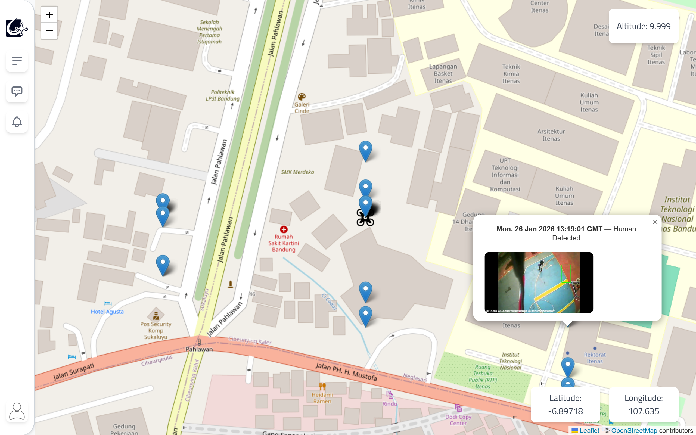
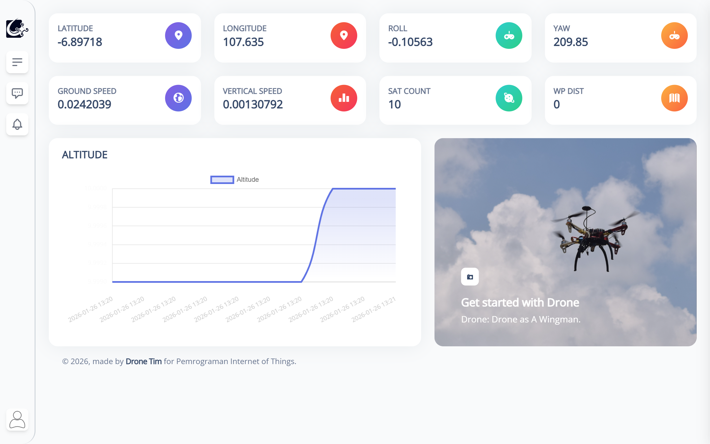
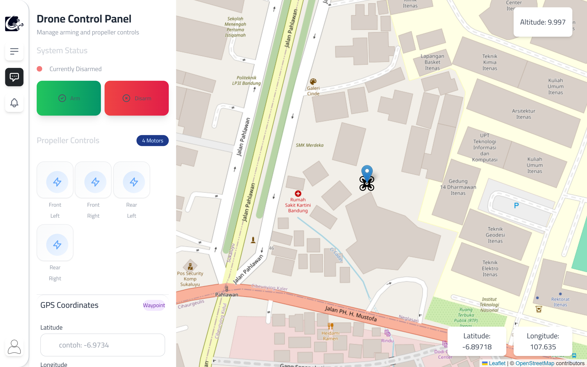

# PrakIOT - Drone Data Monitoring & Control System

A web-based platform for **real-time drone telemetry monitoring and remote control** using **Pixhawk 2.4.8** flight controller and **ArduPilot** firmware. This system allows users to monitor flight data and send control commands directly from a browser, functioning as a lightweight ground control station.



---

## Overview

This project integrates **Pixhawk 2.4.8** with **ArduPilot** and a **web-based dashboard** to provide real-time access to drone telemetry and control features. The platform is designed for **research, education, and experimental UAV development**, enabling users to interact with drones without relying on traditional desktop ground control software.

---

## Features

### Telemetry Monitoring
- GPS position (latitude, longitude, altitude)
- Flight mode status
- Ground speed and vertical speed
- Attitude data (roll, pitch, yaw)
- Satellite count and waypoint distance
- Real-time data updates every 3 seconds

### Drone Control via Website
- Arm and disarm motors
- Individual propeller/motor testing
- GPS waypoint navigation (goto commands)
- Emergency controls

### Map Visualization
- Live drone position tracking with Leaflet.js
- Interactive map with OpenStreetMap tiles
- Human detection markers with timestamp and images
- Drawing tools for mission planning (TerraDraw)

### Web-Based Access
- Modern responsive UI built with TailwindCSS
- AlpineJS for reactive components
- No dedicated ground control software required
- Works on any modern browser



---

## System Architecture

```
+------------------------------------------------------------------+
|                         Web Browser                               |
|  +-------------+  +-------------+  +-------------------------+    |
|  |  Map View   |  |  Controls   |  |  Telemetry Display      |    |
|  |  (Leaflet)  |  |  (Alpine)   |  |  (Altitude, GPS, etc.)  |    |
|  +-------------+  +-------------+  +-------------------------+    |
+------------------------------------------------------------------+
                              |
                              v
+------------------------------------------------------------------+
|                    Node.js Proxy Server                           |
|                    (server.js - Port 8080)                        |
|                    - Proxies /foto requests                       |
+------------------------------------------------------------------+
                              |
                              v
+------------------------------------------------------------------+
|                    Flask Backend Server                           |
|                    (server.py - Port 5000)                        |
|  +-------------+  +-------------+  +-------------------------+    |
|  |  /data      |  |  /command   |  |  /changealt             |    |
|  |  GET/POST   |  |  POST       |  |  POST                   |    |
|  +-------------+  +-------------+  +-------------------------+    |
+------------------------------------------------------------------+
                              |
                              v
+------------------------------------------------------------------+
|                      MySQL Database                               |
|                      (drone_data table)                           |
+------------------------------------------------------------------+
                              |
                              v
+------------------------------------------------------------------+
|                    MissionPlanner Scripts                         |
|  +--------------------------------------------------------------+ |
|  |  postalt.py - Posts telemetry, receives commands             | |
|  |  getalt.py  - GET requests for altitude data                 | |
|  |  main.py    - Basic altitude monitoring                      | |
|  +--------------------------------------------------------------+ |
+------------------------------------------------------------------+
                              |
                              v
+------------------------------------------------------------------+
|                    Pixhawk 2.4.8                                  |
|                    (ArduPilot Firmware)                           |
|                    Connected via USB/Telemetry                    |
+------------------------------------------------------------------+
```

---

## Hardware Requirements

| Component | Description |
|-----------|-------------|
| Flight Controller | Pixhawk 2.4.8 |
| GPS Module | Compatible GPS with compass |
| Telemetry | USB / 433 MHz / 915 MHz radio |
| Frame | Drone frame, motors, ESCs, battery |
| Ground Station | PC / Laptop running MissionPlanner |

---

## Software Requirements

### Firmware
- ArduPilot (Copter / Plane)

### Backend
- Python 3.8+
- Flask
- Flask-CORS
- mysql-connector-python
- Node.js 16+
- Express

### Frontend
- HTML5, CSS3, JavaScript
- TailwindCSS 3.x
- AlpineJS 2.x
- Leaflet.js 1.9.x
- TerraDraw 1.0

### Database
- MySQL / MariaDB

---

## Installation & Setup

### 1. Clone the Repository

```bash
git clone https://github.com/nainxav/drone-data-monitoring-website.git
cd drone-data-monitoring-website
```

### 2. Database Setup

Create a MySQL database. The Flask server will automatically create the required tables on first run.

```sql
-- Optional: Create database manually
CREATE DATABASE IF NOT EXISTS drone;
```

### 3. Backend Setup

#### Python Flask Server

```bash
# Install Python dependencies
pip install flask flask-cors mysql-connector-python

# Configure database connection in server.py
# Edit the dbconfig dictionary:
dbconfig = {
    "host": "localhost",
    "user": "root",
    "password": ""  # Add your MySQL password
}

# Start the Flask server
python server.py
```

The Flask server runs on `http://127.0.0.1:5000`

#### Node.js Proxy Server (Optional)

```bash
# Install Node.js dependencies
npm install

# Start the proxy server
node server.js
```

The Node.js proxy runs on `http://127.0.0.1:8080`

### 4. Frontend Setup

```bash
# Install dependencies
npm install

# Start development server with live reload
npm run serve

# Or build for production
npm run production
```

The frontend will be available at `http://127.0.0.1:8080` (via live-server)

### 5. Pixhawk Configuration

1. Flash ArduPilot firmware to Pixhawk 2.4.8
2. Configure telemetry port and baud rate
3. Calibrate sensors (accelerometer, compass, RC)
4. Set failsafe parameters
5. Connect to MissionPlanner

### 6. MissionPlanner Scripts

Load the Python scripts in MissionPlanner's scripting console:

```python
# For posting telemetry data to server
# Load: postalt.py

# For basic altitude monitoring
# Load: main.py
```

---

## API Documentation

### GET /data
Retrieve all drone telemetry data from the database.

**Response:**
```json
[
  {
    "id": 1,
    "timestamp": "2024-01-15 10:30:00",
    "altitude": 50.5,
    "latitude": -6.895865,
    "longitude": 107.764334,
    "roll": 0.5,
    "groundspeed": 5.2,
    "verticalspeed": 1.0,
    "yaw": 180.0,
    "satcount": 12,
    "wp_dist": 25.5
  }
]
```

### POST /data
Store new telemetry data from the drone.

**Request Body:**
```json
{
  "altitude": 50.5,
  "latitude": -6.895865,
  "longitude": 107.764334,
  "roll": 0.5,
  "groundspeed": 5.2,
  "verticalspeed": 1.0,
  "yaw": 180.0,
  "satcount": 12,
  "wp_dist": 25.5
}
```

### POST /command
Send control commands to the drone.

**Request Body:**
```json
{
  "command": "arm"
}
```

**Available Commands:**
| Command | Description |
|---------|-------------|
| `arm` | Arm the drone motors |
| `disarm` | Disarm the drone motors |
| `testmotor,{n},{pwr}` | Test motor n at power level |
| `goto,{alt},{lat},{lon}` | Navigate to GPS waypoint |

### POST /changealt
Update target coordinates for the drone.

**Request Body:**
```json
{
  "altitude": 100,
  "latitude": -6.895865,
  "longitude": 107.764334
}
```

---

## Project Structure

```
prakIOT/
|-- public/                     # Frontend static files
|   |-- index.html              # Main page with map view
|   |-- dashboard.html          # Dashboard with telemetry cards
|   |-- cards.html              # Telemetry cards component
|   |-- chart.html              # Chart visualization
|   +-- assets/
|       |-- css/
|       |   |-- tailwind.css    # Compiled TailwindCSS
|       |   +-- style.css       # Custom styles
|       |-- js/
|       |   +-- script.js       # Main JavaScript (map, API calls)
|       +-- images/             # Icons, logos, backgrounds
|-- src/
|   +-- tailwind.css            # TailwindCSS source
|-- server.py                   # Flask backend server
|-- server.js                   # Node.js proxy server
|-- postalt.py                  # MissionPlanner telemetry script
|-- getalt.py                   # MissionPlanner GET request script
|-- main.py                     # Basic altitude monitor script
|-- package.json                # Node.js dependencies
|-- tailwind.config.js          # TailwindCSS configuration
|-- postcss.config.js           # PostCSS configuration
+-- README.md                   # This file
```

---

## Usage

### Starting the System

1. **Start MySQL Server** - Ensure MySQL/MariaDB is running

2. **Start Flask Backend**
   ```bash
   python server.py
   ```

3. **Start Frontend**
   ```bash
   npm run serve
   ```

4. **Connect Pixhawk** - Connect via USB or telemetry radio

5. **Run MissionPlanner Script** - Load `postalt.py` in MissionPlanner

### Using the Web Interface

1. **Home Page** - View live map with drone position
2. **Control Panel** - Access via sidebar to arm/disarm and control motors
3. **Waypoint Input** - Enter GPS coordinates to send goto commands
4. **Dashboard** - View detailed telemetry cards and charts



---

## Telemetry Data

| Parameter | Description | Unit |
|-----------|-------------|------|
| altitude | Height above ground | meters |
| latitude | GPS latitude | degrees |
| longitude | GPS longitude | degrees |
| roll | Roll angle | degrees |
| groundspeed | Horizontal speed | m/s |
| verticalspeed | Vertical climb rate | m/s |
| yaw | Heading direction | degrees |
| satcount | GPS satellite count | count |
| wp_dist | Distance to waypoint | meters |

---

## Development

### Build Commands

```bash
# Development build with watch
npm run development

# Production build (minified)
npm run production

# Start dev server with live reload
npm run serve

# Deploy to GitHub Pages
npm run deploy
```

### Customization

- **Map Center**: Edit coordinates in `script.js` line 1
- **Server URL**: Edit `server` constant in `script.js` line 3
- **Database Config**: Edit `dbconfig` in `server.py` line 9
- **Styles**: Modify `tailwind.config.js` for theme customization

---

## Troubleshooting

### Common Issues

**Flask server won't start**
- Check MySQL is running
- Verify database credentials in `server.py`
- Ensure port 5000 is not in use

**No telemetry data**
- Verify MissionPlanner is connected to Pixhawk
- Check `postalt.py` script is running
- Confirm Flask server is accessible at `http://127.0.0.1:5000`

**Map not loading**
- Check internet connection (OpenStreetMap tiles)
- Verify Leaflet.js CDN is accessible

**CORS errors**
- Flask-CORS is required - ensure it's installed
- Check browser console for specific errors

---

## Safety Warnings

- Always test in a controlled environment
- Ensure failsafe parameters are configured
- Never arm the drone indoors without proper precautions
- Keep a manual override RC controller ready
- Follow local drone regulations

---

## Contributing

1. Fork the repository
2. Create a feature branch (`git checkout -b feature/AmazingFeature`)
3. Commit your changes (`git commit -m 'Add some AmazingFeature'`)
4. Push to the branch (`git push origin feature/AmazingFeature`)
5. Open a Pull Request

---

## Acknowledgments

- [ArduPilot](https://ardupilot.org/) - Open source autopilot
- [MissionPlanner](https://ardupilot.org/planner/) - Ground control software
- [Leaflet.js](https://leafletjs.com/) - Interactive maps
- [TailwindCSS](https://tailwindcss.com/) - Utility-first CSS
- [AlpineJS](https://alpinejs.dev/) - Lightweight JavaScript framework
- [TerraDraw](https://terradraw.io/) - Drawing library for maps
- [Kamona UI](https://github.com/kamona-ui) - Dashboard template base

---

## Contact

shafirakf@gmail.com
